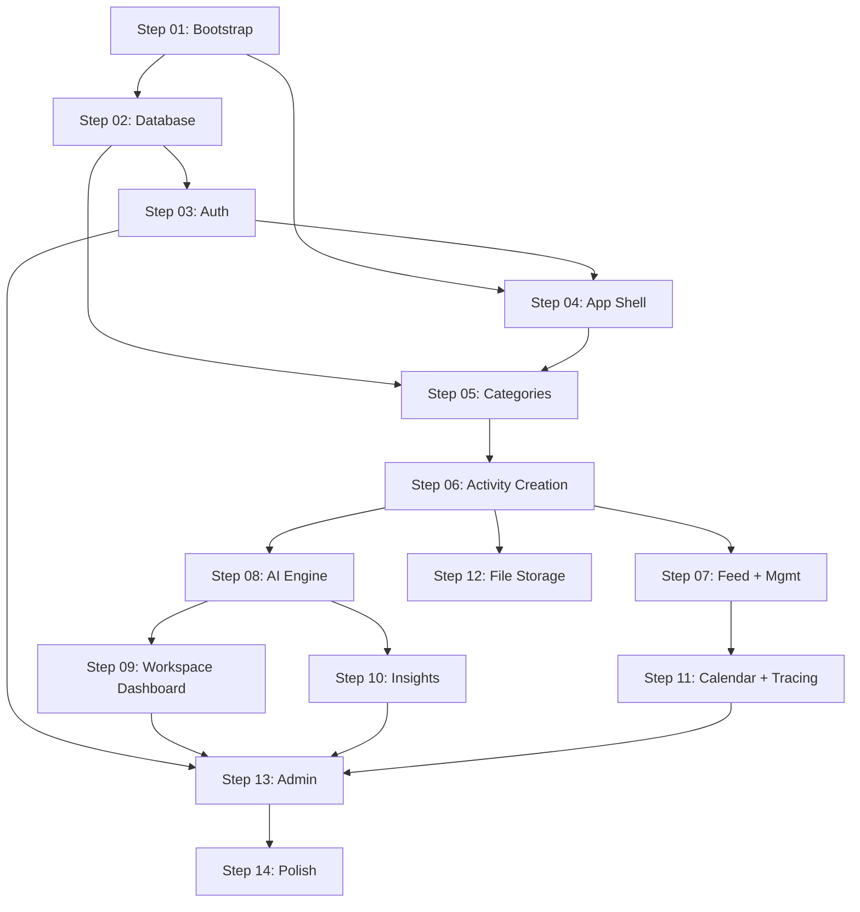

# Progressive Build Protocol (PBP) + Simple Path Execution Roadmap

> This is the original plan that bootstrapped the project. It defines the PBP process and the 14-step roadmap.
> For the living versions, see: [STEPS.md](STEPS.md), [steps/PROCESS.md](steps/PROCESS.md), [CONTEXT.md](CONTEXT.md).

---

## Part 1: The Repeatable Process (PBP)

This is a project-agnostic process. It works for any app you and I build together.

### Living Documents

Every PBP project maintains exactly **four documents** at the project root:

- **PLAN.md** -- Source of truth for *what* we're building. Features, scope, data model, tech stack. Already exists for this project.
- **ARCHITECTURE.md** -- The mental model. *How* the system works, *where* things go, *what patterns* to follow. Aimed at a developer joining the project. Evolves after each step. This is the document that makes a Google architect nod.
- **CONTEXT.md** -- Living memory. Accumulated decisions, gotchas, state of the codebase. What the AI reads at the start of every step to maintain continuity. Append-only (with archival when it gets long).
- **STEPS.md** -- Execution roadmap. All steps listed with status, goal, and dependencies. Updated after each step.

### The Protocol (every step follows this)

```
ORIENT --> PLAN --> BUILD --> VERIFY --> CAPTURE --> EVOLVE
```

**1. ORIENT** (read before touching code)
- Read `CONTEXT.md` (what happened before, decisions in effect)
- Read the step brief (`steps/STEP-XX.md`)
- Review relevant existing source files listed in context
- Understand what patterns are established (from `ARCHITECTURE.md`)

**2. PLAN** (declare intent before building)
- State files to create/modify
- State patterns to follow (cite `ARCHITECTURE.md`)
- Flag any open questions, risks, or PLAN.md deviations

**3. BUILD** (implement against acceptance criteria)
- Follow acceptance criteria from the step brief
- Follow established patterns from `ARCHITECTURE.md`
- Write tests for critical paths (auth, data mutations, AI calls)
- Run linter after edits

**4. VERIFY** (quality gate -- non-negotiable)
- All acceptance criteria met
- Tests pass
- No linter errors introduced
- Code follows `ARCHITECTURE.md` patterns
- Mobile-first check (if UI work)

**5. CAPTURE** (append to `CONTEXT.md`)
- Files delivered (paths)
- Decisions made (and why)
- Patterns established or reinforced
- Gotchas / learnings
- State of codebase for next step

**6. EVOLVE** (update `ARCHITECTURE.md` if the mental model changed)
- New patterns introduced? Document them.
- New conventions adopted? Add them.
- Folder structure changed? Update the map.
- Keep it as the living "developer's guide" to the system.

### Quality Principles (the "Google Architect" bar)

These are enforced across all steps:

- **Single Responsibility**: Each module/file does one thing well
- **Explicit over implicit**: No magic. Clear data flow. Named exports.
- **Colocation**: Keep related code together (server action next to its page, validation next to its schema)
- **Thin server actions**: Validate (Zod) -> call service -> return. Business logic in service layer.
- **Type safety end-to-end**: Supabase-generated types flow from DB to UI. No `any`.
- **Error traceability**: Every error response includes `trace_id`. Structured logging everywhere.
- **Progressive disclosure in code**: Simple cases are simple. Complex cases are possible. (Matches the UX principle.)

---

## Part 2: Simple Path Execution Roadmap (14 Steps)

### Merged Scope (PLAN.md + reqs.md additions)

Features incorporated from reqs.md that weren't in PLAN.md:
- **Participants** on activities (new field/table)
- **Social media posts** on activities (manageable per activity)
- **Activity linking** (relate activities to each other)
- **Activity status/completion** (status field on activities)

Features kept as future (per PLAN.md): Public Site, Suggestion Box, Collaboration (invite flows).

### Step Dependency Graph



### The Steps

**Step 01: Bootstrap + Foundations**
- Next.js 15 (App Router) project in `PoCs/simple-path-opus/`
- Supabase client/server setup (`src/lib/supabase/`)
- Tailwind CSS + design tokens (Inter/Nunito Sans, soft palette, high-contrast actions)
- Core utilities: structured logger, trace_id (AsyncLocalStorage), Zod validation helpers
- Root layout with mobile viewport and fonts
- Folder structure per PLAN.md module structure
- Create initial `ARCHITECTURE.md` (mental model v1)
- Create `.env.example`

**Step 02: Core Database Schema**
- Migration 001: `system`, `users`, `spaces`, `space_notes`, `space_questions`, `space_answers`, `access_codes`
- RLS policies (users see own rows, spaces scoped to user)
- Supabase type generation (`database.types.ts`)
- DB helper utilities (typed query wrappers)

**Step 03: Auth Flow**
- Pages: access code entry, OTP verification
- Server actions: validate code, send/verify OTP, create session
- Auth middleware (route protection)
- Session management (JWT expiry, idle timeout)
- Tests: access code validation, OTP flow, session lifecycle

**Step 04: App Shell + Design System**
- Mobile-first app layout with Slack-style drill-down navigation + minimal bottom bar
- Status toast system (non-intrusive, auto-dismiss, trace_id on errors)
- Loading states, error boundaries with trace_id
- Shared UI component kit (Button, Input, Card, Sheet, Accordion, FAB, Badge, Avatar)
- Empty shell pages as navigation targets

**Step 05: Categories + Channel List**
- Migration 002: `categories`, `category_catalog`, `category_collaborators`, `category_questions`, `category_answers`
- Slack-style channel list (categories as channels with quick snapshot/stats)
- Category creation (pick from system catalog or create custom)
- Category detail/settings (title, description, notes, Q&A planning)
- Server actions + tests for category CRUD

**Step 06: Activity Creation + Schema**
- Migration 003: `questions` (per category, typed), `activities` (with `status`, `participants`), `activity_answers`, `activity_links`, `activity_social_posts`
- Conversational creation flow ("What did you do?" — ChatGPT-like)
- Progressive disclosure: description → accordion questions → optional enrichment
- Question rendering by type (file, table, date, email, phone, rich_text)
- Tests: activity creation, answer validation

**Step 07: Activity Feed + Notion-Style Activity Page**
- Activity list inside channel (infinite scroll, cursor-based pagination)
- Notion-style activity page: title, description, accordion question answers, enrichment sections, notes/comments at bottom
- Inline editing throughout
- Activity CRUD, linking, social posts, tags, participants
- FAB for "Add Activity"

**Step 08: AI Engine + Activity Intelligence**
- Migration 004: `ai_provider_config`, `llm_cost_logs`
- AI provider abstraction layer (OpenAI, Gemini, Perplexity -- strategy pattern)
- LLM cost logging (every call: provider, model, tokens, latency, space_id, trace_id)
- AI-generated `title` + `well_formed_description` on activity save
- Next-steps guidance after activity creation
- Per-activity summary (insights, guidance, assessment)
- Tests: provider abstraction, cost logging, title generation

**Step 09: Knowledge Base + Workspace Dashboard**
- Migration 005: `knowledge_base`
- Knowledge base CRUD (per space, per category -- party agendas, principles, priorities)
- Workspace dashboard (per category: stats, recent activities, AI snapshot)
- AI-powered workspace summary using context graph (activities + answers + knowledge base)
- Knowledge-base alignment display

**Step 10: Insights Engine**
- Migration 006: `insights`
- Insights page: select activities, feed context graph to AI, generate insights/reports
- Knowledge-base alignment (how activities map to party values/agendas)
- Save insights to DB, add notes
- Export/share (formatted report output)

**Step 11: Calendar + Session Tracing**
- Calendar view (activities by date, navigate to detail)
- Migration 007: `session_traces`
- Session tracing layer (capture action_type, action_params, result per session)
- Instrument key flows (auth, activity CRUD, AI calls, insights)
- Trace/session lookup for support

**Step 12: File Storage**
- S3 presigned URL integration (upload + download)
- CloudFront CDN configuration
- File upload in activity creation (for "file" question type + attachments)
- Attachment rendering in feed/detail

**Step 13: Admin Module**
- Admin layout (mobile-first, same drill-down pattern as user app)
- Admin sections as channels → item lists → Notion-style detail pages
- Sub-pages: users + spaces, access codes, category catalog + questions, knowledge base, AI provider config, space features
- LLM cost dashboard, session trace viewer
- Admin auth/role check

**Step 14: Integration + Polish**
- End-to-end flow verification (auth -> channels -> activity -> insights)
- Performance audit (lazy loading, code splitting, query optimization)
- Error handling audit (all errors traceable, user-friendly messages)
- Integration tests for key user journeys
- Final `ARCHITECTURE.md` update
- Final `CONTEXT.md` summary

---

## Part 3: How to Execute

When you're ready to start a step:

```
@steps/STEP-XX.md @steps/PROCESS.md @CONTEXT.md @ARCHITECTURE.md

Execute Step XX. Follow the PBP protocol.
```

The AI will: ORIENT (read context) -> PLAN (declare intent) -> BUILD (implement) -> VERIFY (test + lint) -> CAPTURE (update CONTEXT.md) -> EVOLVE (update ARCHITECTURE.md if needed).

One step per session. Complete each before starting the next. Mark progress in `STEPS.md`.
