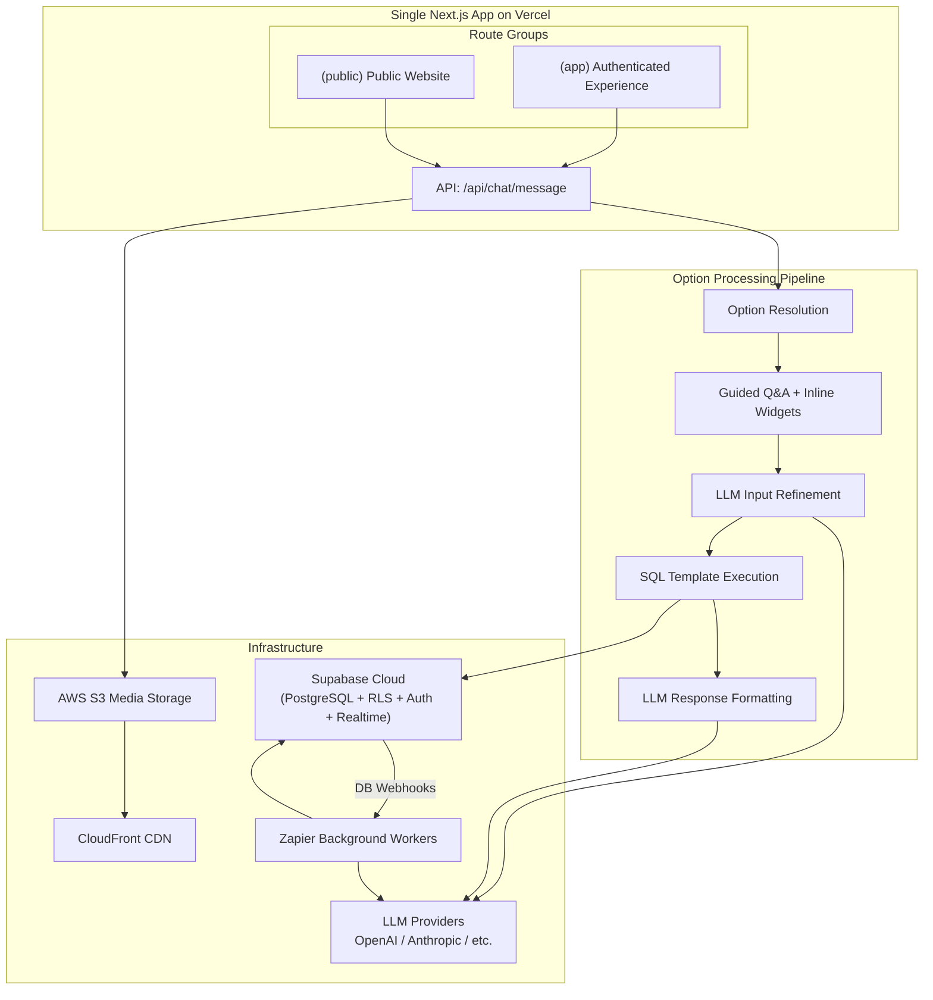
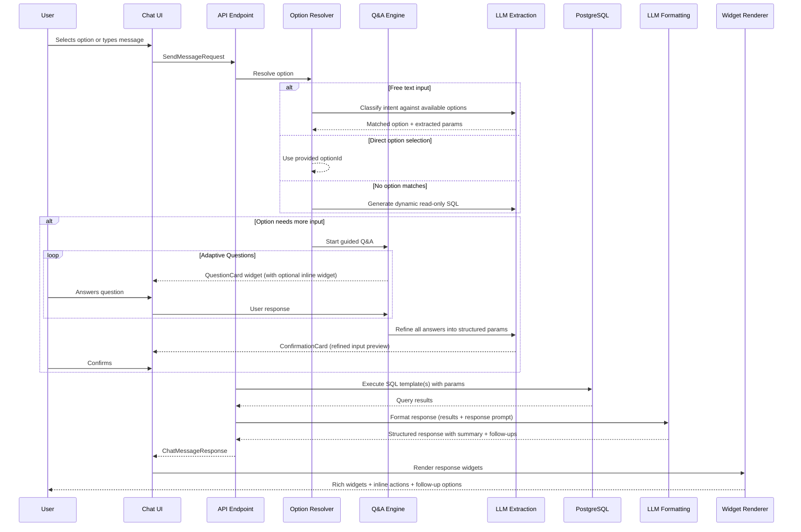
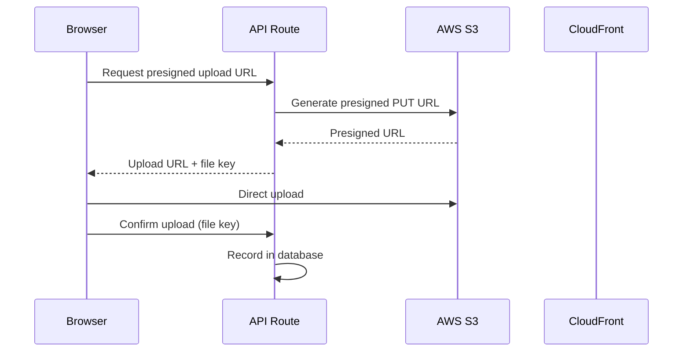
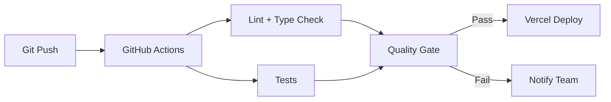

# Dhoota — System Architecture

**Version**: 2.0
**Date**: March 11, 2026
**Status**: Draft

---

## 1. Architecture Overview

Dhoota is a **single Next.js application** that serves multiple experiences (activity tracker, public website, suggestion box, admin panel) from one codebase. The experience each user gets is determined by their **user type** and **configuration**, not by separate applications.

The core architectural innovation is the **Option Processing Pipeline** — a unified engine that processes every user interaction through a consistent flow: option resolution → conversational Q&A → LLM refinement → SQL execution → LLM response formatting → rich widget rendering.



---

## 2. Tech Stack

| Layer | Technology | Rationale |
|-------|-----------|-----------|
| **Framework** | Next.js 14+ (App Router) | Server components, API routes, SSR for public website, image optimization |
| **UI** | React 18+ / Tailwind CSS / shadcn/ui | Component model, rapid dev, accessible components |
| **Database** | Supabase (PostgreSQL 15+) | RLS for multi-tenancy, Realtime for suggestion box, Auth for OTP |
| **Authentication** | Supabase Auth | Email OTP, JWT sessions, RLS integration |
| **Real-time** | Supabase Realtime | WebSocket channels for suggestion box messaging |
| **File Storage** | AWS S3 | Scalable object storage, presigned URLs |
| **CDN** | CloudFront | Edge caching for media delivery |
| **Image Processing** | Next.js Image + sharp | On-the-fly optimization, WebP/AVIF conversion |
| **Background Jobs** | Zapier | Webhook-triggered workflows for reports, AI tasks |
| **LLM** | Provider-agnostic (OpenAI, Anthropic, etc.) | Abstraction layer for flexibility |
| **Deployment** | Vercel | Zero-config Next.js hosting, edge functions |
| **i18n** | next-intl | Server component support, locale-aware formatting |
| **Charts** | Recharts or Chart.js | General charting with LLM-selected chart types |

---

## 3. Single Application Architecture

### 3.1 Route Groups

The app uses Next.js route groups to serve different experiences from one codebase:

```
app/
├── (app)/                  # Authenticated experience (workers, candidates, admins)
│   ├── layout.tsx          # Sidebar + chat layout, auth guard
│   └── page.tsx            # Chat interface — THE app
│
├── (public)/               # Public website experience
│   ├── [slug]/             # Tenant-specific public site
│   │   ├── layout.tsx      # Public website layout (theme, banner)
│   │   ├── page.tsx        # SSR activity feed (SEO)
│   │   ├── chat/page.tsx   # Public chat interface
│   │   └── activity/[id]/page.tsx  # Single activity (SEO)
│   └── layout.tsx          # Public root layout
│
├── (auth)/                 # Auth pages
│   ├── login/page.tsx      # Email OTP login
│   ├── verify/page.tsx     # OTP verification
│   └── citizen/page.tsx    # Mobile + invite code auth
│
└── api/
    ├── chat/
    │   └── message/route.ts    # THE unified endpoint
    ├── auth/                    # Auth routes
    ├── media/                   # File upload (presigned URLs)
    └── webhooks/                # Zapier callbacks
```

### 3.2 User Type Resolution

On authentication, the system resolves the user's type and loads their configuration:

1. JWT contains `user_id` and `tenant_id`
2. Server looks up user type from the `users` table
3. Server loads the user type's default configuration from `user_type_configs`
4. Server loads any per-user overrides from `user_configs`
5. Merged configuration determines: init options, default options, available options, theme

For the public website:
- Anonymous visitors get the `anonymous` user type config (read-only options)
- Authenticated citizens get the `citizen` user type config (includes suggestion box options)

### 3.3 Configuration Hierarchy

```
System Defaults (built-in)
  └── User Type Config (per user_type in DB)
      └── Tenant Overrides (per tenant feature toggles)
          └── User Overrides (per user preferences)
```

---

## 4. Option Processing Pipeline

This is the core engine of Dhoota. Every user interaction flows through this pipeline.

### 4.1 Pipeline Stages



### 4.2 Stage 1: Option Resolution

Three paths based on input:

| Input Type | Resolution | LLM Involved? |
|------------|-----------|:---:|
| Direct option click (default menu, follow-up, inline action) | Use the provided `optionId` directly | No |
| Free text matching a predefined option | LLM classifies against the user's available options, returns best match + extracted params | Yes |
| Free text with no predefined match | LLM generates a dynamic read-only SQL query | Yes |

### 4.3 Stage 2: Guided Q&A

If the resolved option needs input that hasn't been fully provided:

- Each option defines a set of **questions** with optional inline widget hints
- The Q&A engine determines which questions to ask based on what's already known (from extracted params or pre-filled context)
- LLM adaptively groups questions or asks one-by-one based on option complexity
- Each question is rendered as a **QuestionCard** widget in the chat, optionally containing an inline widget (date picker, file uploader, tag selector, etc.)
- User responses are collected until all required inputs are gathered

### 4.4 Stage 3: LLM Input Refinement

Runs on **all inputs**, including structured form-like responses:

- Polishes broken/informal text into clean, well-formed data
- Extracts structured parameters from natural language
- Enriches with suggestions (auto-tags, inferred fields)
- Validates against the option's input schema
- Returns a structured parameter set

The refined input is shown to the user as a **ConfirmationCard** widget before execution.

### 4.5 Stage 4: SQL Template Execution

Each predefined option has one or more SQL templates:

```typescript
interface SqlTemplate {
  id: string;
  sql: string;              // "INSERT INTO activities (tenant_id, title, description, ...) VALUES ($1, $2, $3, ...)"
  paramMapping: Record<string, string>;  // { "tenant_id": "context.tenantId", "title": "params.title", ... }
  type: 'read' | 'write';
}
```

- Templates are parameterized (no string interpolation — prevents SQL injection)
- All queries include `tenant_id` scoping for RLS
- Options can have multiple SQL templates (batch execution)
- For dynamic queries: LLM-generated SQL is validated to be SELECT-only and tenant-scoped before execution

### 4.6 Stage 5: LLM Response Formatting

Takes the SQL results and the option's **response prompt** to generate:

- A human-friendly **summary** of what happened
- **Structured data** formatted for widget rendering
- **Available actions** on the returned objects (inline action buttons)
- **Follow-up option suggestions**
- **Chart type selection** (when data is suitable for visualization — LLM picks bar/line/pie/etc. with sensible defaults per option)

### 4.7 Universal Input/Output Contract

Every interaction uses the same API shapes:

```typescript
interface SendMessageRequest {
  source: 'chat' | 'follow_up' | 'inline_action' | 'default_option' | 'qa_response' | 'confirmation';
  content?: string;                     // Free text
  optionId?: string;                    // Direct option dispatch
  params?: Record<string, unknown>;     // Pre-filled parameters
  files?: FileReference[];              // Uploaded files
  targetResourceId?: string;            // Record being acted on
  targetResourceType?: string;          // 'activity' | 'tag' | etc.
  conversationId: string;
}

interface ChatMessageResponse {
  messageId: string;
  widgets: Widget[];                    // Array of response widgets
  followUps: OptionReference[];         // Suggested next options
  defaultOptions: OptionReference[];    // Always-available options
  conversationState: 'active' | 'awaiting_input' | 'awaiting_confirmation';
}

interface Widget {
  id: string;                           // Unique widget ID (for bookmarking)
  type: WidgetType;                     // 'activity_card' | 'chart' | 'data_table' | etc.
  data: Record<string, unknown>;        // Widget-specific payload
  actions?: WidgetAction[];             // Inline action buttons
  bookmarkable: boolean;
}
```

---

## 5. LLM Abstraction Layer

### 5.1 Provider Interface

```typescript
interface LLMProvider {
  id: string;
  name: string;

  complete(params: CompletionParams): Promise<CompletionResponse>;
  stream(params: CompletionParams): AsyncIterable<CompletionChunk>;

  classifyIntent(input: string, options: OptionSummary[]): Promise<IntentMatch>;
  extractParams(input: string, schema: object): Promise<Record<string, unknown>>;
  refineInput(rawInput: Record<string, unknown>, schema: object): Promise<RefinedInput>;
  formatResponse(results: unknown, responsePrompt: string): Promise<FormattedResponse>;
  generateDynamicSQL(intent: string, schema: TableSchema[]): Promise<string>;
}
```

### 5.2 Provider Strategy

- **Primary provider**: Configured per environment (e.g., OpenAI GPT-4o)
- **Fallback**: Automatic failover if primary is unavailable
- **Per-stage optimization**: Different models for different pipeline stages:
  - Intent classification: Fast model (GPT-4o-mini)
  - Input refinement: Capable model (GPT-4o)
  - Response formatting: Capable model (GPT-4o)
  - Dynamic SQL generation: Capable model with strict guardrails

### 5.3 Cost & Logging

- All LLM calls logged with token counts, latency, success/failure
- Cost tracking per tenant for admin monitoring
- Caching for repeated identical inputs

---

## 6. Multi-Tenancy

### 6.1 Row-Level Security

Every tenant-scoped table includes `tenant_id`. Supabase RLS policies enforce:
- Users can only read/write data belonging to their tenant
- Cross-tenant access is impossible at the database level
- Dynamic SQL queries are also tenant-scoped (tenant_id injected by the pipeline, not by LLM)

### 6.2 Tenant Resolution

| Context | Resolution |
|---------|-----------|
| Authenticated user | JWT claims → `tenant_id` |
| Public website | Subdomain/domain lookup → `tenant_id` |
| Citizen (suggestion box) | Invite code lookup → `tenant_id` |
| Admin | JWT claims → system admin role, can operate across tenants |

### 6.3 Team Linking (Cross-Tenant)

- `tenant_links` table maps leader ↔ worker relationships
- Workers opt-in to sharing selected activities
- Leaders see shared activities via a scoped view
- Leaders cannot write to worker data

---

## 7. File Storage & Media

### 7.1 Upload Flow



### 7.2 Image Optimization

| Stage | Technique |
|-------|-----------|
| Upload | Client-side compression (max 10MB) |
| Processing | Zapier workflow generates variants (thumbnail, medium, large) via sharp |
| Delivery | CloudFront with cache headers, WebP/AVIF negotiation |
| In-app | Next.js `<Image>` component for on-the-fly optimization |

### 7.3 Storage Organization

```
dhoota-media-{env}/
└── {tenant_id}/
    ├── activities/{activity_id}/
    ├── website/
    ├── suggestion-box/{conversation_id}/
    └── profile/
```

---

## 8. Real-Time Architecture

### 8.1 Suggestion Box Messaging

Uses Supabase Realtime for WebSocket-based live messaging:

```typescript
const channel = supabase
  .channel(`sb:${conversationId}`)
  .on('postgres_changes', {
    event: 'INSERT',
    schema: 'public',
    table: 'sb_messages',
    filter: `conversation_id=eq.${conversationId}`,
  }, (payload) => {
    addMessage(payload.new);
  })
  .subscribe();
```

Presence tracking for online status and typing indicators.

### 8.2 Other Real-Time Needs

- Job status updates (report generation): Polling or Realtime subscription on `job_tickets`
- Public website feed updates: ISR with on-demand revalidation (not WebSocket)

---

## 9. Background Processing

### 9.1 Zapier Integration

Jobs triggered via webhooks for tasks that take too long for the request cycle:

| Job Type | Trigger | Output |
|----------|---------|--------|
| Report Generation | User requests a report option → API creates job ticket → webhook fires | PDF/Excel to S3, job ticket updated |
| Image Processing | Media uploaded → DB webhook | Optimized variants to S3 |
| AI Summary | User requests long summary → webhook | Summary text stored in DB |
| Suggestion Report | Scheduled or on-demand | Report card in DB |

### 9.2 Job Tracking

Async jobs create a `job_tickets` row tracked via the **StatusTicket** widget in the chat.

---

## 10. Authentication

### 10.1 Email OTP (Workers, Candidates, Admins)

```
Enter email → Supabase sends OTP → Enter OTP → JWT issued → Session established
```

### 10.2 Mobile + Invite Code (Citizens)

```
Enter mobile + code → Validate pairing → Send OTP to mobile → Enter OTP → Session established
```

### 10.3 Session Management

- JWT with `tenant_id`, `user_type`, `role` in custom claims
- HttpOnly cookies for server-side, in-memory for client
- Automatic token refresh via Supabase client

---

## 11. Feature Flag System

Feature flags stored in `tenant_feature_flags` table:

- Flags filter the option catalog — disabled features hide their options
- Flags are cached in the JWT custom claims for fast evaluation
- Admin manages flags via admin chat options
- Extensible: new flags added without schema changes

---

## 12. Deployment

### 12.1 Single Vercel Project

One Next.js app = one Vercel project. No monorepo orchestration needed.

| Component | Deployment |
|-----------|-----------|
| Next.js App | Vercel (auto-deploy on push) |
| Database | Supabase Cloud |
| Media Storage | AWS S3 + CloudFront |
| Background Jobs | Zapier |
| LLM Providers | API calls to OpenAI/Anthropic |

### 12.2 Environments

| Environment | Purpose |
|-------------|---------|
| Development | Local dev with Supabase local (Docker) |
| Staging | Supabase Cloud staging project + Vercel preview |
| Production | Supabase Cloud production + Vercel production |

### 12.3 CI/CD



---

## 13. Security

| Layer | Mechanism |
|-------|-----------|
| Network | TLS everywhere, Vercel Edge protection, CloudFront signed URLs |
| Authentication | Supabase Auth (JWT), OTP-based, HttpOnly cookies |
| Authorization | RLS policies, feature flag filtering, user type option filtering |
| Data Isolation | `tenant_id` on all rows, RLS enforced at DB level |
| Input Validation | LLM refinement validates inputs; SQL templates use parameterized queries |
| Dynamic SQL Safety | Read-only enforcement, tenant_id injection by pipeline (not LLM), SQL validation before execution |
| Media Security | Presigned URLs with expiration, tenant-scoped S3 paths |
| Rate Limiting | Vercel Edge + Supabase rate limits |
| Audit | All option executions logged with input/output |
