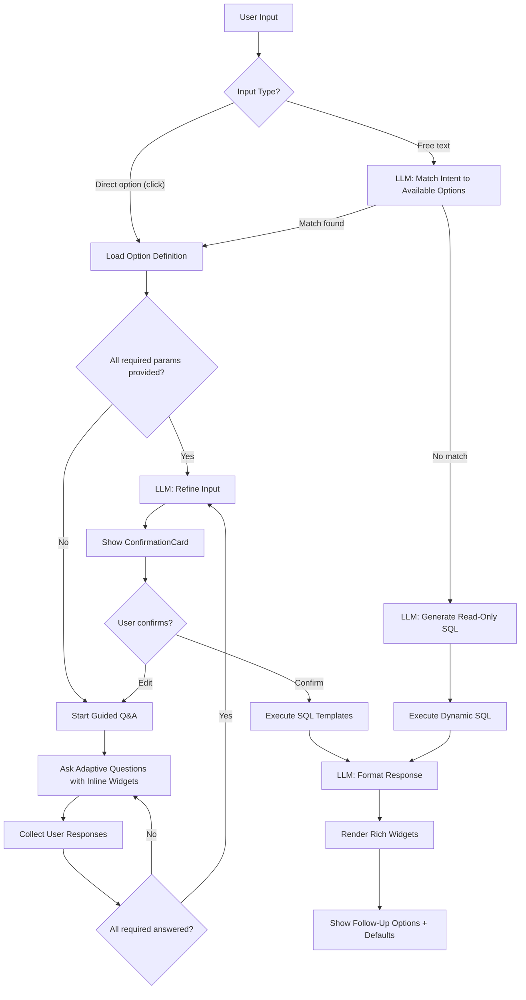

# Dhoota — Chat Framework Design

**Version**: 2.0
**Date**: March 11, 2026
**Status**: Draft

---

## 1. Overview

The chat framework is the core of Dhoota. It replaces traditional CRUD interfaces with a conversational experience where every feature is an option executed through conversation. The framework handles:

- Option resolution (matching user intent to predefined options or generating dynamic queries)
- Conversational guided input (adaptive Q&A with inline widgets)
- AI input refinement (transforming informal/broken input into structured data)
- SQL execution (parameterized templates for safety)
- AI response formatting (summaries, charts, follow-ups)
- Rich widget rendering (cards, tables, charts, galleries, calendars)
- Inline actions on displayed data (click-to-act on any entity)
- Conversation history and granular bookmarking

### Design Principles

1. **Chat IS the app** — there are no pages to navigate to. Everything happens in the conversation.
2. **AI assists, not decides** — AI refines input and formats output. The user always confirms before writes.
3. **Configuration over code** — Options, questions, SQL templates are data. New features = new rows, not new code.
4. **Universal contract** — Every interaction, regardless of option type, uses the same request/response shape.
5. **Progressive enrichment** — Users type keywords or broken sentences, AI elevates them to proper structured data.

---

## 2. Option Processing Pipeline

### 2.1 Pipeline Flow



### 2.2 Stage Details

#### Stage 1: Option Resolution

```typescript
interface OptionResolver {
  resolve(
    input: SendMessageRequest,
    availableOptions: OptionDefinition[],
    context: UserContext
  ): Promise<ResolvedOption>;
}

interface ResolvedOption {
  type: 'predefined' | 'dynamic';
  option?: OptionDefinition;
  extractedParams?: Record<string, unknown>;
  dynamicSql?: string;
  confidence: number;
}
```

Resolution paths:
- **source = 'default_option' | 'follow_up' | 'inline_action'**: Direct lookup by `optionId`. No LLM call.
- **source = 'chat'**: LLM classifies the user's text against available option descriptions and keywords. Returns the best match with any extractable parameters.
- **No match**: LLM generates a SELECT-only SQL query scoped to the tenant.

#### Stage 2: Guided Q&A

When the resolved option needs input that wasn't fully provided (missing required params):

```typescript
interface QAEngine {
  start(option: OptionDefinition, knownParams: Record<string, unknown>): QASession;
  processResponse(session: QASession, response: string): QAResult;
}

interface QASession {
  optionId: string;
  questions: OptionQuestion[];
  answeredQuestions: Map<string, unknown>;
  remainingQuestions: OptionQuestion[];
  currentGroup: OptionQuestion[];
}

interface QAResult {
  status: 'need_more' | 'complete';
  nextQuestions?: OptionQuestion[];
  collectedParams?: Record<string, unknown>;
}
```

**Adaptive question grouping**: The Q&A engine asks the LLM to decide whether to ask questions one-by-one or in groups, based on:
- Option complexity (simple = grouped, complex = one at a time)
- User's response style (terse answers → one at a time, verbose → grouped)
- Question dependencies (dependent questions follow their prerequisite)

**Inline widgets**: Each question can specify an `inline_widget` type:

| Widget | Trigger | Rendered As |
|--------|---------|-------------|
| `date_picker` | Date/time questions | Calendar popup |
| `file_upload` | Media/document questions | Drag-and-drop zone |
| `tag_select` | Tag selection | Searchable multi-select |
| `location_picker` | Location questions | Text with autocomplete |
| `status_select` | Status fields | Dropdown |
| `visibility_select` | Visibility fields | Radio group |
| `color_picker` | Color selection | Color swatches |

#### Stage 3: LLM Input Refinement

Every input, regardless of source (chat, Q&A answers, inline form), passes through refinement:

```typescript
interface InputRefiner {
  refine(
    rawInput: Record<string, unknown>,
    inputSchema: object,
    context: { userLanguageHint?: string; recentActivities?: Activity[] }
  ): Promise<RefinedInput>;
}

interface RefinedInput {
  params: Record<string, unknown>;
  suggestions: {
    tags?: Tag[];
    inferred?: Record<string, unknown>;
  };
  refinementNotes: string[];
}
```

Refinement behaviors:
- "school opning ward 5 today mornig" → `{ title: "School Opening Ceremony - Ward 5", description: "Attended the school opening ceremony in Ward 5.", activity_date: "2026-03-11T09:00:00Z", location: "Ward 5" }`
- Auto-suggest tags based on content: ["Education", "Community", "Ceremony"]
- Infer missing fields when possible (date = today, status = completed for past events)

After refinement, the system shows a **ConfirmationCard**:
- Displays the refined data in a clear, readable format
- Highlights AI-inferred values vs. user-provided values
- "Confirm" and "Edit" buttons
- "Edit" re-enters the Q&A flow for the fields the user wants to change

#### Stage 4: SQL Execution

```typescript
interface SqlExecutor {
  execute(
    templates: SqlTemplate[],
    params: Record<string, unknown>,
    tenantId: string
  ): Promise<SqlResult[]>;
}
```

- Templates are loaded from the `sql_templates` table for the option
- Parameters are mapped from refined input to SQL placeholders
- Multiple templates execute in order within a transaction
- `tenant_id` is always injected from the session (never from user input)

#### Stage 5: Response Formatting

```typescript
interface ResponseFormatter {
  format(
    option: OptionDefinition,
    sqlResults: SqlResult[],
    context: UserContext
  ): Promise<FormattedResponse>;
}

interface FormattedResponse {
  summary: string;
  widgets: Widget[];
  followUps: OptionReference[];
}
```

The LLM uses the option's `response_prompt` template to generate:
- A concise summary ("Activity created successfully. 2 photos attached, tagged with Education and Community.")
- Widget specifications with correctly typed data
- Follow-up options relevant to the action

---

## 3. Option Definition Model

### 3.1 Schema (in DB)

```typescript
interface OptionDefinition {
  id: string;                             // 'activity.create'
  name: string;                           // 'Create Activity'
  description: string;                    // Used for LLM intent matching
  category: string;                       // 'activity' | 'view' | 'report' | etc.
  icon: string;                           // UI icon
  keywords: string[];                     // Boost intent matching
  userTypes: string[];                    // Accessible user types
  requiredToggles: string[];              // Required feature flags
  showInDefaults: boolean;                // Show in default options menu
  defaultPriority: number;                // Sort order in defaults
  acceptsFiles: boolean;                  // Can accept file uploads
  inputSchema: object;                    // JSON Schema for parameters
  responsePrompt: string;                 // LLM prompt for formatting results
  followUpOptionIds: string[];            // Static follow-ups
  questions: OptionQuestion[];            // Guided Q&A questions
  sqlTemplates: SqlTemplate[];            // SQL to execute
}
```

### 3.2 MVP Option Catalog

| ID | Name | Category | Default | Accepts Files |
|----|------|----------|:-------:|:-------------:|
| `activity.create` | Create Activity | activity | Yes | Yes |
| `activity.list` | View Activities | activity | Yes | No |
| `activity.view` | View Activity | activity | No | No |
| `activity.edit` | Edit Activity | activity | No | Yes |
| `activity.delete` | Delete Activity | activity | No | No |
| `activity.add_note` | Add Note | activity | No | Yes |
| `activity.add_media` | Add Media | activity | No | Yes |
| `activity.set_visibility` | Set Visibility | activity | No | No |
| `view.timeline` | Activity Timeline | view | Yes | No |
| `view.calendar` | Activity Calendar | view | Yes | No |
| `view.stats` | Activity Stats | view | Yes | No |
| `view.channel` | Channel View | view | No | No |
| `tag.manage` | Manage Tags | activity | No | No |
| `tag.create` | Create Tag | activity | No | No |
| `report.weekly` | Weekly Summary | report | No | No |
| `report.monthly` | Monthly Summary | report | No | No |
| `report.by_tag` | Tag Breakdown | report | No | No |
| `report.adhoc` | Ad-Hoc Report | report | No | No |
| `sb.inbox` | Suggestion Inbox | suggestion_box | Yes | No |
| `sb.reply` | Reply to Suggestion | suggestion_box | No | Yes |
| `sb.create_bucket` | Create Code Bucket | suggestion_box | No | No |
| `sb.generate_codes` | Generate Codes | suggestion_box | No | No |
| `sb.view_codes` | View Codes | suggestion_box | No | No |
| `sb.invite_citizen` | Invite Citizen | suggestion_box | No | No |
| `website.configure` | Configure Website | website | No | Yes |
| `website.theme` | Change Theme | website | No | No |
| `website.widgets` | Manage Widgets | website | No | No |
| `website.preview` | Preview Website | website | No | No |
| `team.dashboard` | Team Dashboard | team | No | No |
| `team.invite` | Invite Worker | team | No | No |
| `team.manage_sharing` | Manage Sharing | team | No | No |
| `settings.profile` | Edit Profile | settings | No | Yes |
| `settings.preferences` | Preferences | settings | No | No |
| `bookmark.list` | View Bookmarks | settings | No | No |
| `admin.create_tenant` | Create Tenant | admin | Yes | No |
| `admin.manage_flags` | Manage Features | admin | Yes | No |
| `admin.view_users` | View Users | admin | Yes | No |
| `admin.system_health` | System Health | admin | Yes | No |
| `admin.ai_usage` | AI Usage Stats | admin | Yes | No |

### 3.3 Default Configs by User Type

**Worker**:
- Init: `activity.list`, `view.stats`
- Defaults: `activity.create`, `activity.list`, `view.timeline`, `view.calendar`, `view.stats`
- Available: All activity, view, tag, report, settings, bookmark options

**Candidate**:
- Init: `activity.list`, `view.stats`, `team.dashboard`
- Defaults: Same as Worker + `team.dashboard`, `sb.inbox`, `website.configure`
- Available: All except admin options

**Citizen**:
- Init: (none — suggestion box shows conversations)
- Defaults: `sb.view_conversations`, `sb.send_suggestion`
- Available: Suggestion box options only

**Admin**:
- Init: `admin.system_health`, `admin.ai_usage`
- Defaults: All admin options
- Available: Admin options only

---

## 4. Widget System

### 4.1 Widget Architecture

```typescript
interface Widget {
  id: string;                   // Unique per widget instance (for bookmarking)
  type: WidgetType;
  data: Record<string, unknown>;
  actions?: WidgetAction[];
  bookmarkable: boolean;
  paginationState?: PaginationState;
}

interface WidgetAction {
  label: string;
  icon: string;
  optionId: string;
  params?: Record<string, unknown>;
  targetResourceId?: string;
  targetResourceType?: string;
  requiresConfirmation?: boolean;
}

interface PaginationState {
  page: number;
  pageSize: number;
  totalItems: number;
  totalPages: number;
}
```

### 4.2 Widget Types & Rendering

```typescript
type WidgetType =
  | 'text_response'        // Markdown text
  | 'activity_card'        // Single activity with media preview
  | 'data_list'            // Paginated list of items
  | 'data_table'           // Sortable/filterable table
  | 'calendar'             // Month/week/day calendar
  | 'timeline'             // Chronological timeline
  | 'chart'                // Charts (bar, line, pie, area, donut)
  | 'stats_card'           // Key metric with trend
  | 'media_gallery'        // Image/video grid
  | 'tag_cloud'            // Tag visualization
  | 'summary'              // AI narrative summary
  | 'conversation_thread'  // Real-time message thread
  | 'code_list'            // Invite codes with copy buttons
  | 'website_preview'      // Embedded iframe preview
  | 'status_ticket'        // Async job tracking
  | 'confirmation_card'    // Refined input preview
  | 'question_card'        // Q&A question with optional widget
  | 'default_options_menu' // Clickable option cards
  | 'error_card';          // Error display
```

### 4.3 Widget Component Registry

Each widget type maps to a React component:

```typescript
const widgetRegistry: Record<WidgetType, React.ComponentType<WidgetProps>> = {
  text_response: TextResponseWidget,
  activity_card: ActivityCardWidget,
  data_list: DataListWidget,
  data_table: DataTableWidget,
  calendar: CalendarWidget,
  timeline: TimelineWidget,
  chart: ChartWidget,
  stats_card: StatsCardWidget,
  media_gallery: MediaGalleryWidget,
  tag_cloud: TagCloudWidget,
  summary: SummaryWidget,
  conversation_thread: ConversationThreadWidget,
  code_list: CodeListWidget,
  website_preview: WebsitePreviewWidget,
  status_ticket: StatusTicketWidget,
  confirmation_card: ConfirmationCardWidget,
  question_card: QuestionCardWidget,
  default_options_menu: DefaultOptionsMenuWidget,
  error_card: ErrorCardWidget,
};

function MessageRenderer({ message }: { message: ChatMessage }) {
  return (
    <div>
      {message.widgets.map((widget) => {
        const Component = widgetRegistry[widget.type];
        return (
          <Component
            key={widget.id}
            widget={widget}
            onAction={handleAction}
            onBookmark={handleBookmark}
          />
        );
      })}
    </div>
  );
}
```

### 4.4 Chart Widget Details

The chart widget supports dynamic chart type selection by the LLM:

```typescript
interface ChartWidgetData {
  chartType: 'bar' | 'line' | 'pie' | 'area' | 'donut' | 'stacked_bar';
  title: string;
  subtitle?: string;
  labels: string[];
  datasets: {
    label: string;
    data: number[];
    color?: string;
  }[];
  xAxisLabel?: string;
  yAxisLabel?: string;
}
```

The LLM's response formatting stage selects the chart type based on data characteristics:
- Comparisons → bar chart
- Trends over time → line/area chart
- Proportions → pie/donut chart
- Multi-series comparisons → stacked bar

### 4.5 DataList Pagination

Paginated lists support server-side pagination:

```typescript
interface DataListWidgetData {
  items: Record<string, unknown>[];
  columns: {
    key: string;
    label: string;
    sortable?: boolean;
    filterable?: boolean;
  }[];
  pagination: PaginationState;
  sortBy?: string;
  sortOrder?: 'asc' | 'desc';
  filters?: Record<string, unknown>;
}
```

When the user pages/sorts/filters, the widget triggers a re-execution of the same option with updated params (page, sort, filter), without starting a new conversation turn.

### 4.6 Inline Actions

Every entity rendered in a widget can have action buttons:

```
┌────────────────────────────────────────────┐
│ ActivityCard                               │
│                                            │
│ School Opening Ceremony - Ward 5           │
│ March 11, 2026 | Education, Community      │
│ [2 photos]                                 │
│                                            │
│ ┌──────┐ ┌──────────┐ ┌───────┐ ┌──────┐  │
│ │ Edit │ │ Add Note │ │ Share │ │ ☆    │  │
│ └──────┘ └──────────┘ └───────┘ └──────┘  │
└────────────────────────────────────────────┘
```

When the user clicks "Edit":
```typescript
{
  source: 'inline_action',
  optionId: 'activity.edit',
  targetResourceId: 'activity-uuid-123',
  targetResourceType: 'activity',
  params: { /* pre-filled from the current card data */ }
}
```

The pipeline then starts the Q&A flow for editing, pre-filled with existing values.

---

## 5. Welcome & Init Experience

### 5.1 First Load Flow

When a user first opens the app:

1. System resolves user type and loads configuration
2. Executes the batch of **init options** (e.g., `activity.list` + `view.stats`)
3. Renders results as widgets in the chat (recent activities, stats)
4. Shows **default options menu** as the last widget

```
┌──────────────────────────────────────────┐
│ 👋 Welcome back, Ravi!                   │
│                                          │
│ ┌──────────────────────────────────────┐ │
│ │ StatsCard: 12 activities this week   │ │
│ │ ↑3 from last week | 4 pending       │ │
│ └──────────────────────────────────────┘ │
│                                          │
│ ┌──────────────────────────────────────┐ │
│ │ DataList: Recent Activities          │ │
│ │ 1. School Opening - Ward 5 (today)  │ │
│ │ 2. Road Inspection (yesterday)      │ │
│ │ 3. Community Meeting (Mar 9)        │ │
│ │ [Edit] [Add Note] [View] per item   │ │
│ └──────────────────────────────────────┘ │
│                                          │
│ ┌──────────────────────────────────────┐ │
│ │ What would you like to do?           │ │
│ │                                      │ │
│ │ [➕ Add Activity] [📋 Timeline]      │ │
│ │ [📅 Calendar]     [📊 Stats]         │ │
│ └──────────────────────────────────────┘ │
└──────────────────────────────────────────┘
```

### 5.2 Empty State

For new users with no data:

```
┌──────────────────────────────────────────┐
│ Welcome to Dhoota!                       │
│                                          │
│ Let's get started. I'll help you track   │
│ your activities, manage your public      │
│ profile, and connect with citizens.      │
│                                          │
│ ┌──────────────────────────────────────┐ │
│ │ What would you like to do?           │ │
│ │                                      │ │
│ │ [➕ Add Your First Activity]          │ │
│ │ [⚙️ Set Up Your Profile]              │ │
│ └──────────────────────────────────────┘ │
└──────────────────────────────────────────┘
```

---

## 6. Guided Q&A Flow — Detailed Example

### 6.1 Activity Creation Q&A

```
User: clicks "Add Activity"

[QuestionCard]
System: "Tell me about your activity. What did you do?"
         (inline: text area)

User: "went school opening ward 5"

[QuestionCard]
System: "When did this happen?"
         (inline: date_picker, prefilled with today)

User: (selects today, 9:00 AM)

[QuestionCard]
System: "Any photos or videos from the event?"
         (inline: file_upload, accepts image/*, video/*)

User: (uploads 2 photos)

[QuestionCard]
System: "Who should be able to see this? Just you, your team, or everyone?"
         (inline: visibility_select — Private / Team / Public)

User: clicks "Public"

[ConfirmationCard]
System: "Here's what I've prepared:

         Title: School Opening Ceremony - Ward 5
         Description: Attended the school opening ceremony in Ward 5.
         Date: March 11, 2026 at 9:00 AM
         Location: Ward 5
         Visibility: Public
         Tags: Education (suggested), Community (suggested)
         Media: 2 photos

         [✅ Save] [✏️ Edit] [❌ Cancel]"

User: clicks "Save"

[ActivityCard]
System: "Activity created successfully!

         [School Opening Ceremony - Ward 5]
         [2 photos preview]
         [Edit] [Add Note] [Share on Website] [View Timeline]"
```

### 6.2 Adaptive Grouping

For simpler options, the Q&A engine groups questions:

```
User: clicks "Create Tag"

[QuestionCard — Grouped]
System: "Let's create a new tag:
         Name: _______________
         Color: [color_picker]
         "

User: fills both fields inline

[ConfirmationCard]
System: "Create tag 'Rally' with color blue? [✅ Confirm] [✏️ Edit]"
```

### 6.3 Free Text Bypass

When the user types enough info to skip Q&A:

```
User: "add activity: visited the new bridge construction site in ward 12 
       yesterday, took some photos" [attaches 3 photos]

System: (LLM extracts all params — title, description, date, location, media)

[ConfirmationCard]
System: "Here's what I've prepared:

         Title: Bridge Construction Site Visit - Ward 12
         Description: Visited the new bridge construction site in Ward 12 
                      to inspect progress.
         Date: March 10, 2026
         Location: Ward 12
         Tags: Infrastructure (suggested), Inspection (suggested)
         Media: 3 photos

         [✅ Save] [✏️ Edit] [❌ Cancel]"
```

---

## 7. Dynamic Query Handling

When the user's free text doesn't match any predefined option:

```
User: "which ward had the most activities in January?"

System: (LLM recognizes no predefined option matches)
        (LLM generates: SELECT location, COUNT(*) as count FROM activities 
         WHERE tenant_id = $1 AND activity_date >= '2026-01-01' 
         AND activity_date < '2026-02-01' GROUP BY location 
         ORDER BY count DESC)

[ChartWidget — bar chart]
System: "Here's your activity distribution by ward in January:

         [Bar chart: Ward 5: 15, Ward 12: 11, Ward 3: 8, ...]

         Ward 5 led with 15 activities, followed by Ward 12 with 11.

         [View Ward 5 Activities] [View January Timeline] [Export Data]"
```

**Safety guardrails for dynamic SQL**:
1. Only SELECT statements allowed (parsed and validated)
2. Must include `tenant_id = $1` (injected by the pipeline, not LLM)
3. Cannot reference system tables or option_definitions
4. Query execution has a timeout (5 seconds)
5. Result set capped at 1000 rows

---

## 8. Conversation Management

### 8.1 Conversation Model

```typescript
interface Conversation {
  id: string;
  title: string;
  context: 'tracker' | 'admin' | 'public' | 'suggestion_box';
  messages: ChatMessage[];
  isArchived: boolean;
  createdAt: Date;
  updatedAt: Date;
}

interface ChatMessage {
  id: string;
  role: 'user' | 'assistant' | 'system';
  content?: string;
  source: string;
  optionId?: string;
  widgets: Widget[];
  followUps: OptionReference[];
  createdAt: Date;
}
```

### 8.2 Conversation Lifecycle

1. **Auto-create**: A new conversation is created when the user starts a new session or clicks "New Conversation"
2. **Continue**: Subsequent messages in the same session append to the current conversation
3. **Context window**: The pipeline includes the last N messages from the current conversation as context for the LLM (for follow-up awareness)
4. **Archive**: Users can archive old conversations
5. **Search**: Full-text search across conversation content

### 8.3 Conversation Sidebar

The UI shows a sidebar with:
- Current active conversation
- Recent conversations (clickable to resume)
- Search bar for finding old conversations
- "New Conversation" button

---

## 9. Bookmarking System

### 9.1 Granular Bookmarking

Every assistant response contains widgets, each with a unique `id`. Users can bookmark:
- The entire message (all widgets together)
- A specific widget within a message (e.g., just the chart, not the text)

### 9.2 Bookmark Lists

```typescript
interface BookmarkList {
  id: string;
  name: string;
  isDefault: boolean;
  bookmarks: Bookmark[];
}

interface Bookmark {
  id: string;
  messageId: string;
  widgetId?: string;    // If null, bookmarks the whole message
  note?: string;
  createdAt: Date;
}
```

### 9.3 Bookmark Interaction

- Long-press or hover on any widget → "Bookmark" icon appears
- Click → Choose list (default or custom) → Saved
- Access via "View Bookmarks" option → DataList of bookmarked items
- Each bookmark renders the original widget snapshot

---

## 10. Suggestion Box Chat Integration

### 10.1 Worker View

Workers interact with suggestion box through the tracker chat:

```
User: clicks "Suggestion Inbox"

[DataList]
System: "You have 3 unread suggestions:

         1. [Anonymous 42] — 'Road repair needed in sector 9'
            [Unread] [2 hours ago]
         2. [Anonymous 15] — 'Thank you for the park cleanup'
            [Unread] [Yesterday]
         3. [Anonymous 7] — 'Can we get a bus stop near...'
            [Read] [2 days ago]

         [Open] [Mark Resolved] [Star] per item"

User: clicks "Open" on first suggestion

[ConversationThread — real-time]
System: Shows the full message thread with the citizen
         Input box at bottom for replies
         [Type your reply...] [📎 Attach] [Send]
```

### 10.2 Citizen View

Citizens interact through the public website chat:

```
[On public website chat]
System: "Welcome! You're connected to [Representative Name]'s 
         suggestion box. What would you like to share?"

Citizen: "The road near the school in sector 9 has many potholes. 
          It's dangerous for children."

System: "Your suggestion has been sent. [Representative Name] will 
         review it. You'll be notified when they respond.

         [Send Another Suggestion] [View My Conversations]"
```

---

## 11. Real-Time Features

### 11.1 Suggestion Box Real-Time

Supabase Realtime channels for live messaging:

```typescript
function useConversationChannel(conversationId: string) {
  useEffect(() => {
    const channel = supabase
      .channel(`sb:${conversationId}`)
      .on('postgres_changes', {
        event: 'INSERT',
        schema: 'public',
        table: 'sb_messages',
        filter: `conversation_id=eq.${conversationId}`,
      }, (payload) => {
        appendMessage(payload.new as SBMessage);
      })
      .subscribe();

    return () => { supabase.removeChannel(channel); };
  }, [conversationId]);
}
```

### 11.2 Presence & Typing

- Online status indicators for citizen ↔ worker
- Typing indicators using Supabase Realtime Presence

---

## 12. Performance Targets

| Operation | Target | Notes |
|-----------|--------|-------|
| Direct option execution (no LLM) | < 500ms | SQL only, no AI involvement |
| Guided Q&A: question delivery | < 1.5s | Includes LLM decision on grouping |
| LLM input refinement | < 3s | Including confirmation card rendering |
| Full pipeline: free text → result | < 5s | All 5 stages |
| Dynamic SQL generation + execution | < 4s | LLM SQL gen + validation + execution |
| Widget rendering (client) | < 200ms | React render time |
| Pagination/sort (same option) | < 500ms | SQL only, no LLM |
| Real-time message delivery | < 500ms | WebSocket |
| Init config batch execution | < 3s | Multiple options in parallel |

---

## 13. Error Handling

### 13.1 Pipeline Failures

| Stage | Failure | User Experience |
|-------|---------|-----------------|
| Option Resolution | No match + dynamic SQL fails | "I couldn't understand that. Could you rephrase, or choose an option below?" + default menu |
| Q&A | Invalid answer | Re-ask with clarification |
| Input Refinement | LLM timeout | Retry once, then "I'm having trouble processing. Try again?" |
| SQL Execution | Query failure | Error card with retry option |
| Response Formatting | LLM timeout | Return raw data in a simple table widget |
| Dynamic SQL | Timeout or too many rows | "That query was too complex. Try narrowing it down." |

### 13.2 Recovery

- All option executions are logged in `option_executions` (success or failure)
- Users can retry failed operations via the error card
- The conversation context helps the retry understand what was attempted

---

## 14. Extensibility

### 14.1 Adding a New Option

To add a new feature, insert rows into three tables:

1. **`option_definitions`**: Define the option (name, description, keywords, user types, input schema, response prompt)
2. **`sql_templates`**: Define the SQL operations
3. **`option_questions`**: Define the guided Q&A questions (if the option needs input)

No code changes required for the pipeline. The option is automatically available to configured users.

### 14.2 Adding a New Widget Type

To add a new visual representation:

1. Create a new React component following the `WidgetProps` interface
2. Register it in the `widgetRegistry`
3. Update the response prompt templates to reference the new widget type

### 14.3 Adding a New Inline Widget

To add a new input widget for Q&A:

1. Create a new React component for the inline input
2. Register it in the `inlineWidgetRegistry`
3. Reference the widget type in `option_questions.inline_widget`
