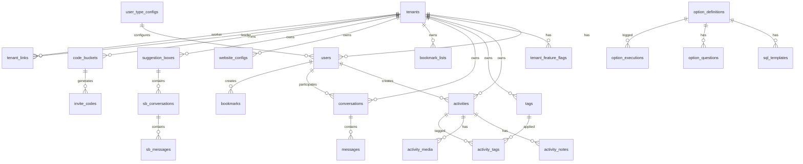

# Dhoota — Database Schema Design

**Version**: 2.0
**Date**: March 11, 2026
**Status**: Draft

---

## 1. Overview

Dhoota uses Supabase (PostgreSQL 15+) with Row-Level Security (RLS) for multi-tenant isolation. The schema reflects the unified single-app architecture where everything is an option and configuration drives the experience.

### Conventions

- All tables use `uuid` primary keys (`gen_random_uuid()`)
- All tables include `created_at` and `updated_at` timestamps
- Soft deletes via `deleted_at` where applicable
- `tenant_id` on all tenant-scoped tables
- JSONB for flexible/extensible data
- PostgreSQL ENUMs for fixed value sets

---

## 2. Entity-Relationship Diagram



---

## 3. Schema Definitions

### 3.1 Option System

```sql
-- Option definitions — the core feature catalog
CREATE TABLE option_definitions (
    id              text PRIMARY KEY,               -- e.g., 'activity.create', 'view.timeline'
    name            text NOT NULL,                  -- Human-readable: 'Create Activity'
    description     text NOT NULL,                  -- For LLM matching: 'Create a new activity...'
    category        text NOT NULL,                  -- 'activity' | 'view' | 'report' | 'website' | 'suggestion_box' | 'team' | 'admin' | 'settings'
    icon            text,                           -- Icon identifier for UI
    keywords        text[] DEFAULT '{}',            -- Boost LLM matching
    user_types      text[] NOT NULL,                -- Which user types can access: ['worker', 'candidate', 'representative']
    required_toggles text[] DEFAULT '{}',           -- Feature flags required: ['ai_features']
    show_in_defaults boolean NOT NULL DEFAULT false,
    default_priority integer DEFAULT 100,           -- Lower = higher in menu
    accepts_files   boolean NOT NULL DEFAULT false,
    input_schema    jsonb,                          -- JSON Schema for structured input parameters
    response_prompt text NOT NULL,                  -- LLM prompt template for formatting the response
    follow_up_option_ids text[] DEFAULT '{}',       -- Static follow-up options
    is_active       boolean NOT NULL DEFAULT true,
    metadata        jsonb DEFAULT '{}',
    created_at      timestamptz NOT NULL DEFAULT now(),
    updated_at      timestamptz NOT NULL DEFAULT now()
);

-- SQL templates for each option (one option can have multiple)
CREATE TABLE sql_templates (
    id              uuid PRIMARY KEY DEFAULT gen_random_uuid(),
    option_id       text NOT NULL REFERENCES option_definitions(id),
    name            text NOT NULL,                  -- 'insert_activity', 'update_tags', etc.
    sql             text NOT NULL,                  -- Parameterized SQL: 'INSERT INTO activities (...) VALUES ($1, $2, ...)'
    param_mapping   jsonb NOT NULL,                 -- Maps extracted params to SQL $N placeholders
    execution_order integer NOT NULL DEFAULT 0,     -- Order within the option's batch
    query_type      text NOT NULL DEFAULT 'write',  -- 'read' | 'write'
    metadata        jsonb DEFAULT '{}',
    created_at      timestamptz NOT NULL DEFAULT now()
);

-- Questions for guided Q&A per option
CREATE TABLE option_questions (
    id              uuid PRIMARY KEY DEFAULT gen_random_uuid(),
    option_id       text NOT NULL REFERENCES option_definitions(id),
    question_text   text NOT NULL,                  -- "What did you do? Just describe it."
    question_key    text NOT NULL,                  -- Maps to the param name: 'title', 'description'
    question_order  integer NOT NULL DEFAULT 0,
    is_required     boolean NOT NULL DEFAULT true,
    inline_widget   text,                           -- 'date_picker' | 'file_upload' | 'tag_select' | 'location_picker' | null
    widget_config   jsonb DEFAULT '{}',             -- Widget-specific config (e.g., accepted file types)
    groupable       boolean NOT NULL DEFAULT true,  -- Can this question be grouped with adjacent questions?
    metadata        jsonb DEFAULT '{}',
    created_at      timestamptz NOT NULL DEFAULT now()
);

-- Audit log of every option execution
CREATE TABLE option_executions (
    id              uuid PRIMARY KEY DEFAULT gen_random_uuid(),
    tenant_id       uuid NOT NULL REFERENCES tenants(id),
    user_id         uuid NOT NULL REFERENCES users(id),
    option_id       text NOT NULL REFERENCES option_definitions(id),
    conversation_id uuid NOT NULL REFERENCES conversations(id),
    input_params    jsonb NOT NULL,                 -- Refined input parameters
    raw_input       jsonb,                          -- Original user input before refinement
    sql_results     jsonb,                          -- Results from SQL execution
    response_data   jsonb,                          -- Formatted response
    execution_ms    integer,                        -- Total execution time
    llm_tokens_used integer,                        -- Total LLM tokens consumed
    success         boolean NOT NULL DEFAULT true,
    error_message   text,
    created_at      timestamptz NOT NULL DEFAULT now()
);

CREATE INDEX idx_option_definitions_category ON option_definitions(category);
CREATE INDEX idx_option_definitions_user_types ON option_definitions USING gin(user_types);
CREATE INDEX idx_sql_templates_option ON sql_templates(option_id, execution_order);
CREATE INDEX idx_option_questions_option ON option_questions(option_id, question_order);
CREATE INDEX idx_option_executions_tenant ON option_executions(tenant_id, created_at DESC);
CREATE INDEX idx_option_executions_option ON option_executions(option_id);
```

### 3.2 User Types & Configuration

```sql
CREATE TYPE user_type AS ENUM (
    'worker', 'candidate', 'representative', 'team_worker',
    'citizen', 'anonymous', 'system_admin'
);

-- Default configuration per user type
CREATE TABLE user_type_configs (
    id                  uuid PRIMARY KEY DEFAULT gen_random_uuid(),
    user_type           user_type NOT NULL UNIQUE,
    init_option_ids     text[] NOT NULL DEFAULT '{}',    -- Batch executed on app load
    default_option_ids  text[] NOT NULL DEFAULT '{}',    -- Shown in default menu
    available_option_ids text[] NOT NULL DEFAULT '{}',   -- All accessible options
    theme_config        jsonb DEFAULT '{}',               -- UI theme overrides
    metadata            jsonb DEFAULT '{}',
    created_at          timestamptz NOT NULL DEFAULT now(),
    updated_at          timestamptz NOT NULL DEFAULT now()
);

-- Per-user configuration overrides
CREATE TABLE user_configs (
    id              uuid PRIMARY KEY DEFAULT gen_random_uuid(),
    user_id         uuid NOT NULL UNIQUE REFERENCES users(id),
    tenant_id       uuid NOT NULL REFERENCES tenants(id),
    init_option_ids text[],                         -- Override init options (NULL = use type default)
    default_option_ids text[],                      -- Override default menu
    available_option_ids text[],                    -- Override available options
    theme_config    jsonb,                          -- Override theme
    preferences     jsonb DEFAULT '{}',             -- User preferences
    created_at      timestamptz NOT NULL DEFAULT now(),
    updated_at      timestamptz NOT NULL DEFAULT now()
);

CREATE INDEX idx_user_configs_user ON user_configs(user_id);
CREATE INDEX idx_user_configs_tenant ON user_configs(tenant_id);
```

### 3.3 Tenants & Users

```sql
CREATE TYPE subscription_level AS ENUM ('basic', 'standard', 'premium');

CREATE TABLE tenants (
    id              uuid PRIMARY KEY DEFAULT gen_random_uuid(),
    name            text NOT NULL,
    slug            text NOT NULL UNIQUE,
    subscription    subscription_level NOT NULL DEFAULT 'basic',
    custom_domain   text UNIQUE,
    owner_user_id   uuid,
    metadata        jsonb DEFAULT '{}',
    created_at      timestamptz NOT NULL DEFAULT now(),
    updated_at      timestamptz NOT NULL DEFAULT now(),
    deleted_at      timestamptz
);

CREATE TABLE users (
    id              uuid PRIMARY KEY DEFAULT gen_random_uuid(),
    tenant_id       uuid NOT NULL REFERENCES tenants(id),
    auth_user_id    uuid NOT NULL UNIQUE,
    email           text,
    phone           text,
    display_name    text NOT NULL,
    avatar_url      text,
    user_type       user_type NOT NULL DEFAULT 'worker',
    bio             text,
    metadata        jsonb DEFAULT '{}',
    created_at      timestamptz NOT NULL DEFAULT now(),
    updated_at      timestamptz NOT NULL DEFAULT now(),
    deleted_at      timestamptz
);

ALTER TABLE tenants ADD CONSTRAINT fk_tenants_owner FOREIGN KEY (owner_user_id) REFERENCES users(id);

CREATE INDEX idx_users_tenant ON users(tenant_id);
CREATE INDEX idx_users_auth_user ON users(auth_user_id);
CREATE INDEX idx_users_user_type ON users(user_type);
CREATE INDEX idx_tenants_slug ON tenants(slug);
CREATE INDEX idx_tenants_custom_domain ON tenants(custom_domain) WHERE custom_domain IS NOT NULL;
```

### 3.4 Feature Flags

```sql
CREATE TABLE tenant_feature_flags (
    id              uuid PRIMARY KEY DEFAULT gen_random_uuid(),
    tenant_id       uuid NOT NULL REFERENCES tenants(id),
    flag_key        text NOT NULL,
    enabled         boolean NOT NULL DEFAULT false,
    metadata        jsonb DEFAULT '{}',
    created_at      timestamptz NOT NULL DEFAULT now(),
    updated_at      timestamptz NOT NULL DEFAULT now(),
    UNIQUE(tenant_id, flag_key)
);

CREATE INDEX idx_feature_flags_tenant ON tenant_feature_flags(tenant_id);
```

### 3.5 Activities

```sql
CREATE TYPE activity_status AS ENUM ('planned', 'in_progress', 'completed', 'cancelled');
CREATE TYPE activity_visibility AS ENUM ('private', 'team', 'public');

CREATE TABLE activities (
    id              uuid PRIMARY KEY DEFAULT gen_random_uuid(),
    tenant_id       uuid NOT NULL REFERENCES tenants(id),
    created_by      uuid NOT NULL REFERENCES users(id),
    title           text NOT NULL,
    description     text,
    status          activity_status NOT NULL DEFAULT 'completed',
    visibility      activity_visibility NOT NULL DEFAULT 'private',
    activity_date   timestamptz NOT NULL DEFAULT now(),
    location        text,
    is_pinned       boolean NOT NULL DEFAULT false,
    metadata        jsonb DEFAULT '{}',
    created_at      timestamptz NOT NULL DEFAULT now(),
    updated_at      timestamptz NOT NULL DEFAULT now(),
    deleted_at      timestamptz
);

CREATE TABLE activity_notes (
    id              uuid PRIMARY KEY DEFAULT gen_random_uuid(),
    tenant_id       uuid NOT NULL REFERENCES tenants(id),
    activity_id     uuid NOT NULL REFERENCES activities(id) ON DELETE CASCADE,
    created_by      uuid NOT NULL REFERENCES users(id),
    content         text NOT NULL,
    metadata        jsonb DEFAULT '{}',
    created_at      timestamptz NOT NULL DEFAULT now(),
    updated_at      timestamptz NOT NULL DEFAULT now(),
    deleted_at      timestamptz
);

CREATE TYPE media_type AS ENUM ('image', 'video', 'document');
CREATE TYPE media_status AS ENUM ('uploading', 'processing', 'ready', 'failed');

CREATE TABLE activity_media (
    id                  uuid PRIMARY KEY DEFAULT gen_random_uuid(),
    tenant_id           uuid NOT NULL REFERENCES tenants(id),
    activity_id         uuid REFERENCES activities(id) ON DELETE SET NULL,
    note_id             uuid REFERENCES activity_notes(id) ON DELETE SET NULL,
    uploaded_by         uuid NOT NULL REFERENCES users(id),
    media_type          media_type NOT NULL,
    original_filename   text NOT NULL,
    s3_key              text NOT NULL,
    file_size_bytes     bigint NOT NULL,
    mime_type           text NOT NULL,
    processing_status   media_status NOT NULL DEFAULT 'uploading',
    variants            jsonb DEFAULT '{}',
    width               integer,
    height              integer,
    duration_seconds    integer,
    metadata            jsonb DEFAULT '{}',
    created_at          timestamptz NOT NULL DEFAULT now(),
    updated_at          timestamptz NOT NULL DEFAULT now()
);

CREATE INDEX idx_activities_tenant ON activities(tenant_id);
CREATE INDEX idx_activities_tenant_date ON activities(tenant_id, activity_date DESC);
CREATE INDEX idx_activities_tenant_visibility ON activities(tenant_id, visibility);
CREATE INDEX idx_activities_created_by ON activities(created_by);
CREATE INDEX idx_activity_notes_activity ON activity_notes(activity_id, created_at);
CREATE INDEX idx_activity_media_activity ON activity_media(activity_id);
CREATE INDEX idx_activity_media_processing ON activity_media(processing_status) WHERE processing_status != 'ready';
```

### 3.6 Tags

```sql
CREATE TYPE tag_source AS ENUM ('system', 'custom', 'ai');

CREATE TABLE tags (
    id              uuid PRIMARY KEY DEFAULT gen_random_uuid(),
    tenant_id       uuid REFERENCES tenants(id),
    name            text NOT NULL,
    slug            text NOT NULL,
    color           text,
    source          tag_source NOT NULL DEFAULT 'custom',
    is_hidden       boolean NOT NULL DEFAULT false,
    parent_tag_id   uuid REFERENCES tags(id),
    metadata        jsonb DEFAULT '{}',
    created_at      timestamptz NOT NULL DEFAULT now(),
    updated_at      timestamptz NOT NULL DEFAULT now(),
    UNIQUE(tenant_id, slug)
);

CREATE TABLE activity_tags (
    id              uuid PRIMARY KEY DEFAULT gen_random_uuid(),
    activity_id     uuid NOT NULL REFERENCES activities(id) ON DELETE CASCADE,
    tag_id          uuid NOT NULL REFERENCES tags(id) ON DELETE CASCADE,
    confidence      real,
    created_at      timestamptz NOT NULL DEFAULT now(),
    UNIQUE(activity_id, tag_id)
);

CREATE INDEX idx_tags_tenant ON tags(tenant_id);
CREATE INDEX idx_activity_tags_activity ON activity_tags(activity_id);
CREATE INDEX idx_activity_tags_tag ON activity_tags(tag_id);
```

### 3.7 Conversations & Messages (Chat System)

```sql
CREATE TYPE conversation_context AS ENUM ('tracker', 'admin', 'public', 'suggestion_box');

CREATE TABLE conversations (
    id              uuid PRIMARY KEY DEFAULT gen_random_uuid(),
    tenant_id       uuid NOT NULL REFERENCES tenants(id),
    user_id         uuid NOT NULL REFERENCES users(id),
    context         conversation_context NOT NULL DEFAULT 'tracker',
    title           text,
    is_archived     boolean NOT NULL DEFAULT false,
    metadata        jsonb DEFAULT '{}',
    created_at      timestamptz NOT NULL DEFAULT now(),
    updated_at      timestamptz NOT NULL DEFAULT now()
);

CREATE TYPE message_role AS ENUM ('user', 'assistant', 'system');

CREATE TABLE messages (
    id                  uuid PRIMARY KEY DEFAULT gen_random_uuid(),
    conversation_id     uuid NOT NULL REFERENCES conversations(id) ON DELETE CASCADE,
    tenant_id           uuid NOT NULL REFERENCES tenants(id),
    role                message_role NOT NULL,
    content             text,
    source              text,                       -- 'chat' | 'follow_up' | 'inline_action' | 'qa_response' | etc.
    option_id           text REFERENCES option_definitions(id),
    widgets             jsonb DEFAULT '[]',         -- Array of rendered widgets
    follow_ups          jsonb DEFAULT '[]',         -- Suggested follow-up options
    input_params        jsonb,                      -- Refined input (for user messages that triggered an option)
    metadata            jsonb DEFAULT '{}',
    created_at          timestamptz NOT NULL DEFAULT now()
);

CREATE INDEX idx_conversations_tenant_user ON conversations(tenant_id, user_id, updated_at DESC);
CREATE INDEX idx_messages_conversation ON messages(conversation_id, created_at);
CREATE INDEX idx_messages_tenant ON messages(tenant_id);
```

### 3.8 Bookmarks

```sql
CREATE TABLE bookmark_lists (
    id              uuid PRIMARY KEY DEFAULT gen_random_uuid(),
    tenant_id       uuid NOT NULL REFERENCES tenants(id),
    user_id         uuid NOT NULL REFERENCES users(id),
    name            text NOT NULL,
    is_default      boolean NOT NULL DEFAULT false,
    metadata        jsonb DEFAULT '{}',
    created_at      timestamptz NOT NULL DEFAULT now(),
    updated_at      timestamptz NOT NULL DEFAULT now()
);

CREATE TABLE bookmarks (
    id              uuid PRIMARY KEY DEFAULT gen_random_uuid(),
    tenant_id       uuid NOT NULL REFERENCES tenants(id),
    user_id         uuid NOT NULL REFERENCES users(id),
    list_id         uuid NOT NULL REFERENCES bookmark_lists(id) ON DELETE CASCADE,
    message_id      uuid NOT NULL REFERENCES messages(id) ON DELETE CASCADE,
    widget_id       text,                           -- Specific widget within the message (NULL = whole message)
    note            text,
    created_at      timestamptz NOT NULL DEFAULT now(),
    UNIQUE(list_id, message_id, widget_id)
);

CREATE INDEX idx_bookmark_lists_user ON bookmark_lists(tenant_id, user_id);
CREATE INDEX idx_bookmarks_list ON bookmarks(list_id, created_at DESC);
CREATE INDEX idx_bookmarks_message ON bookmarks(message_id);
```

### 3.9 Suggestion Box

```sql
CREATE TABLE suggestion_boxes (
    id              uuid PRIMARY KEY DEFAULT gen_random_uuid(),
    tenant_id       uuid NOT NULL REFERENCES tenants(id),
    name            text NOT NULL,
    description     text,
    is_active       boolean NOT NULL DEFAULT true,
    metadata        jsonb DEFAULT '{}',
    created_at      timestamptz NOT NULL DEFAULT now(),
    updated_at      timestamptz NOT NULL DEFAULT now()
);

CREATE TABLE code_buckets (
    id                  uuid PRIMARY KEY DEFAULT gen_random_uuid(),
    tenant_id           uuid NOT NULL REFERENCES tenants(id),
    suggestion_box_id   uuid NOT NULL REFERENCES suggestion_boxes(id) ON DELETE CASCADE,
    name                text NOT NULL,
    description         text,
    metadata            jsonb DEFAULT '{}',
    created_at          timestamptz NOT NULL DEFAULT now(),
    updated_at          timestamptz NOT NULL DEFAULT now()
);

CREATE TABLE citizens (
    id              uuid PRIMARY KEY DEFAULT gen_random_uuid(),
    phone_hash      text NOT NULL UNIQUE,
    phone_encrypted text NOT NULL,
    display_name    text,
    metadata        jsonb DEFAULT '{}',
    created_at      timestamptz NOT NULL DEFAULT now(),
    updated_at      timestamptz NOT NULL DEFAULT now()
);

CREATE TABLE invite_codes (
    id              uuid PRIMARY KEY DEFAULT gen_random_uuid(),
    tenant_id       uuid NOT NULL REFERENCES tenants(id),
    bucket_id       uuid NOT NULL REFERENCES code_buckets(id) ON DELETE CASCADE,
    code_hash       text NOT NULL UNIQUE,
    citizen_id      uuid REFERENCES citizens(id),
    phone_hash      text,
    is_used         boolean NOT NULL DEFAULT false,
    expires_at      timestamptz,
    metadata        jsonb DEFAULT '{}',
    created_at      timestamptz NOT NULL DEFAULT now()
);

CREATE TYPE sb_conversation_status AS ENUM ('active', 'resolved', 'starred', 'archived');
CREATE TYPE sb_sender_type AS ENUM ('worker', 'citizen');

CREATE TABLE sb_conversations (
    id                  uuid PRIMARY KEY DEFAULT gen_random_uuid(),
    tenant_id           uuid NOT NULL REFERENCES tenants(id),
    suggestion_box_id   uuid NOT NULL REFERENCES suggestion_boxes(id),
    citizen_id          uuid NOT NULL REFERENCES citizens(id),
    status              sb_conversation_status NOT NULL DEFAULT 'active',
    last_message_at     timestamptz,
    unread_worker_count integer NOT NULL DEFAULT 0,
    unread_citizen_count integer NOT NULL DEFAULT 0,
    metadata            jsonb DEFAULT '{}',
    created_at          timestamptz NOT NULL DEFAULT now(),
    updated_at          timestamptz NOT NULL DEFAULT now(),
    UNIQUE(suggestion_box_id, citizen_id)
);

CREATE TABLE sb_messages (
    id                  uuid PRIMARY KEY DEFAULT gen_random_uuid(),
    conversation_id     uuid NOT NULL REFERENCES sb_conversations(id) ON DELETE CASCADE,
    tenant_id           uuid NOT NULL REFERENCES tenants(id),
    sender_type         sb_sender_type NOT NULL,
    sender_id           uuid NOT NULL,
    content             text NOT NULL,
    media_urls          jsonb DEFAULT '[]',
    is_read             boolean NOT NULL DEFAULT false,
    metadata            jsonb DEFAULT '{}',
    created_at          timestamptz NOT NULL DEFAULT now()
);

CREATE INDEX idx_suggestion_boxes_tenant ON suggestion_boxes(tenant_id);
CREATE INDEX idx_code_buckets_tenant ON code_buckets(tenant_id);
CREATE INDEX idx_invite_codes_code ON invite_codes(code_hash);
CREATE INDEX idx_invite_codes_phone ON invite_codes(phone_hash) WHERE phone_hash IS NOT NULL;
CREATE INDEX idx_sb_conversations_tenant ON sb_conversations(tenant_id, last_message_at DESC);
CREATE INDEX idx_sb_conversations_citizen ON sb_conversations(citizen_id);
CREATE INDEX idx_sb_messages_conversation ON sb_messages(conversation_id, created_at);
CREATE INDEX idx_sb_messages_unread ON sb_messages(conversation_id, is_read) WHERE is_read = false;
```

### 3.10 Public Website Configuration

```sql
CREATE TYPE website_layout AS ENUM ('feed_sidebar', 'full_width', 'grid', 'magazine');
CREATE TYPE widget_type AS ENUM ('bio', 'contact', 'social_links', 'key_stats', 'upcoming_events', 'custom_html', 'custom_text');

CREATE TABLE website_configs (
    id              uuid PRIMARY KEY DEFAULT gen_random_uuid(),
    tenant_id       uuid NOT NULL UNIQUE REFERENCES tenants(id),
    is_published    boolean NOT NULL DEFAULT false,
    layout          website_layout NOT NULL DEFAULT 'feed_sidebar',
    theme_id        text NOT NULL DEFAULT 'default',
    theme_overrides jsonb DEFAULT '{}',
    banner_image_url text,
    banner_title    text,
    banner_subtitle text,
    banner_config   jsonb DEFAULT '{}',
    footer_content  jsonb DEFAULT '{}',
    seo_config      jsonb DEFAULT '{}',
    show_suggestion_box boolean NOT NULL DEFAULT false,
    suggestion_box_cta text DEFAULT 'Share Your Suggestions',
    metadata        jsonb DEFAULT '{}',
    created_at      timestamptz NOT NULL DEFAULT now(),
    updated_at      timestamptz NOT NULL DEFAULT now()
);

CREATE TABLE website_widgets (
    id              uuid PRIMARY KEY DEFAULT gen_random_uuid(),
    tenant_id       uuid NOT NULL REFERENCES tenants(id),
    website_config_id uuid NOT NULL REFERENCES website_configs(id) ON DELETE CASCADE,
    widget_type     widget_type NOT NULL,
    title           text,
    content         jsonb NOT NULL DEFAULT '{}',
    sort_order      integer NOT NULL DEFAULT 0,
    is_visible      boolean NOT NULL DEFAULT true,
    metadata        jsonb DEFAULT '{}',
    created_at      timestamptz NOT NULL DEFAULT now(),
    updated_at      timestamptz NOT NULL DEFAULT now()
);

CREATE INDEX idx_website_configs_tenant ON website_configs(tenant_id);
CREATE INDEX idx_website_widgets_config ON website_widgets(website_config_id, sort_order);
```

### 3.11 Team Linking

```sql
CREATE TYPE link_status AS ENUM ('pending', 'accepted', 'declined', 'revoked');
CREATE TYPE sharing_scope AS ENUM ('all', 'public_only', 'by_tag');

CREATE TABLE tenant_links (
    id                  uuid PRIMARY KEY DEFAULT gen_random_uuid(),
    leader_tenant_id    uuid NOT NULL REFERENCES tenants(id),
    worker_tenant_id    uuid NOT NULL REFERENCES tenants(id),
    status              link_status NOT NULL DEFAULT 'pending',
    sharing_scope       sharing_scope NOT NULL DEFAULT 'public_only',
    shared_tag_ids      uuid[] DEFAULT '{}',
    invited_by          uuid NOT NULL REFERENCES users(id),
    accepted_by         uuid REFERENCES users(id),
    metadata            jsonb DEFAULT '{}',
    created_at          timestamptz NOT NULL DEFAULT now(),
    updated_at          timestamptz NOT NULL DEFAULT now(),
    UNIQUE(leader_tenant_id, worker_tenant_id),
    CHECK (leader_tenant_id != worker_tenant_id)
);

CREATE INDEX idx_tenant_links_leader ON tenant_links(leader_tenant_id, status);
CREATE INDEX idx_tenant_links_worker ON tenant_links(worker_tenant_id, status);
```

### 3.12 Reports & Jobs

```sql
CREATE TYPE job_status AS ENUM ('queued', 'processing', 'completed', 'failed');
CREATE TYPE job_type AS ENUM ('report_generation', 'image_processing', 'ai_summary', 'suggestion_report', 'notification', 'export');

CREATE TABLE job_tickets (
    id              uuid PRIMARY KEY DEFAULT gen_random_uuid(),
    tenant_id       uuid NOT NULL REFERENCES tenants(id),
    created_by      uuid REFERENCES users(id),
    type            job_type NOT NULL,
    status          job_status NOT NULL DEFAULT 'queued',
    input_data      jsonb NOT NULL DEFAULT '{}',
    result_data     jsonb,
    error_message   text,
    attempts        integer NOT NULL DEFAULT 0,
    started_at      timestamptz,
    completed_at    timestamptz,
    metadata        jsonb DEFAULT '{}',
    created_at      timestamptz NOT NULL DEFAULT now(),
    updated_at      timestamptz NOT NULL DEFAULT now()
);

CREATE INDEX idx_job_tickets_tenant ON job_tickets(tenant_id);
CREATE INDEX idx_job_tickets_status ON job_tickets(status) WHERE status IN ('queued', 'processing');
```

### 3.13 LLM Interaction Logs

```sql
CREATE TABLE llm_logs (
    id              uuid PRIMARY KEY DEFAULT gen_random_uuid(),
    tenant_id       uuid REFERENCES tenants(id),
    user_id         uuid REFERENCES users(id),
    provider        text NOT NULL,
    model           text NOT NULL,
    operation       text NOT NULL,                  -- 'classify_intent' | 'extract_params' | 'refine_input' | 'format_response' | 'generate_sql'
    prompt_tokens   integer,
    completion_tokens integer,
    latency_ms      integer,
    success         boolean NOT NULL DEFAULT true,
    error_message   text,
    metadata        jsonb DEFAULT '{}',
    created_at      timestamptz NOT NULL DEFAULT now()
);

CREATE INDEX idx_llm_logs_tenant ON llm_logs(tenant_id, created_at DESC);
CREATE INDEX idx_llm_logs_operation ON llm_logs(operation);
```

---

## 4. Row-Level Security Policies

### 4.1 Helper Functions

```sql
CREATE OR REPLACE FUNCTION auth.tenant_id()
RETURNS uuid AS $$
    SELECT (current_setting('request.jwt.claims', true)::jsonb ->> 'tenant_id')::uuid;
$$ LANGUAGE sql STABLE;

CREATE OR REPLACE FUNCTION auth.is_system_admin()
RETURNS boolean AS $$
    SELECT (current_setting('request.jwt.claims', true)::jsonb ->> 'user_type') = 'system_admin';
$$ LANGUAGE sql STABLE;

CREATE OR REPLACE FUNCTION auth.user_id()
RETURNS uuid AS $$
    SELECT (current_setting('request.jwt.claims', true)::jsonb ->> 'user_id')::uuid;
$$ LANGUAGE sql STABLE;
```

### 4.2 Standard Tenant Isolation

Applied to all tenant-scoped tables:

```sql
-- Template for tenant-scoped tables
ALTER TABLE {table} ENABLE ROW LEVEL SECURITY;

CREATE POLICY "tenant_select" ON {table} FOR SELECT USING (
    tenant_id = auth.tenant_id() OR auth.is_system_admin()
);
CREATE POLICY "tenant_insert" ON {table} FOR INSERT WITH CHECK (
    tenant_id = auth.tenant_id()
);
CREATE POLICY "tenant_update" ON {table} FOR UPDATE USING (
    tenant_id = auth.tenant_id()
);
CREATE POLICY "tenant_delete" ON {table} FOR DELETE USING (
    tenant_id = auth.tenant_id()
);
```

### 4.3 Special Policies

**Tags** — system tags readable by all:
```sql
CREATE POLICY "tags_read" ON tags FOR SELECT USING (
    tenant_id IS NULL OR tenant_id = auth.tenant_id() OR auth.is_system_admin()
);
```

**Public activities** — readable without auth for public website:
```sql
CREATE POLICY "activities_public_read" ON activities FOR SELECT USING (
    visibility = 'public' OR tenant_id = auth.tenant_id() OR auth.is_system_admin()
);
```

**Option definitions** — readable by all authenticated users:
```sql
CREATE POLICY "options_read" ON option_definitions FOR SELECT USING (true);
CREATE POLICY "options_admin_write" ON option_definitions FOR ALL USING (auth.is_system_admin());
```

---

## 5. Functions & Triggers

### 5.1 Auto-Update Timestamps

```sql
CREATE OR REPLACE FUNCTION update_updated_at()
RETURNS TRIGGER AS $$
BEGIN NEW.updated_at = now(); RETURN NEW; END;
$$ LANGUAGE plpgsql;
```

### 5.2 Auto-Create Default Bookmark List

```sql
CREATE OR REPLACE FUNCTION create_default_bookmark_list()
RETURNS TRIGGER AS $$
BEGIN
    INSERT INTO bookmark_lists (tenant_id, user_id, name, is_default)
    VALUES (NEW.tenant_id, NEW.id, 'Saved Items', true);
    RETURN NEW;
END;
$$ LANGUAGE plpgsql;

CREATE TRIGGER trg_user_default_bookmark_list
    AFTER INSERT ON users FOR EACH ROW EXECUTE FUNCTION create_default_bookmark_list();
```

### 5.3 Update SB Conversation Counters

```sql
CREATE OR REPLACE FUNCTION update_sb_unread_counts()
RETURNS TRIGGER AS $$
BEGIN
    IF NEW.sender_type = 'citizen' THEN
        UPDATE sb_conversations SET unread_worker_count = unread_worker_count + 1,
            last_message_at = NEW.created_at WHERE id = NEW.conversation_id;
    ELSIF NEW.sender_type = 'worker' THEN
        UPDATE sb_conversations SET unread_citizen_count = unread_citizen_count + 1,
            last_message_at = NEW.created_at WHERE id = NEW.conversation_id;
    END IF;
    RETURN NEW;
END;
$$ LANGUAGE plpgsql;

CREATE TRIGGER trg_sb_message_counts
    AFTER INSERT ON sb_messages FOR EACH ROW EXECUTE FUNCTION update_sb_unread_counts();
```

---

## 6. Migration Order

1. `001_create_enums.sql`
2. `002_create_tenants_users.sql`
3. `003_create_feature_flags.sql`
4. `004_create_option_system.sql` — option_definitions, sql_templates, option_questions, option_executions
5. `005_create_user_configs.sql` — user_type_configs, user_configs
6. `006_create_activities.sql`
7. `007_create_tags.sql`
8. `008_create_conversations_messages.sql`
9. `009_create_bookmarks.sql`
10. `010_create_suggestion_box.sql`
11. `011_create_website.sql`
12. `012_create_team_linking.sql`
13. `013_create_jobs.sql`
14. `014_create_llm_logs.sql`
15. `015_create_rls_policies.sql`
16. `016_create_functions_triggers.sql`
17. `017_seed_system_tags.sql`
18. `018_seed_option_definitions.sql` — All predefined options with SQL templates and questions
19. `019_seed_user_type_configs.sql` — Default configs per user type
